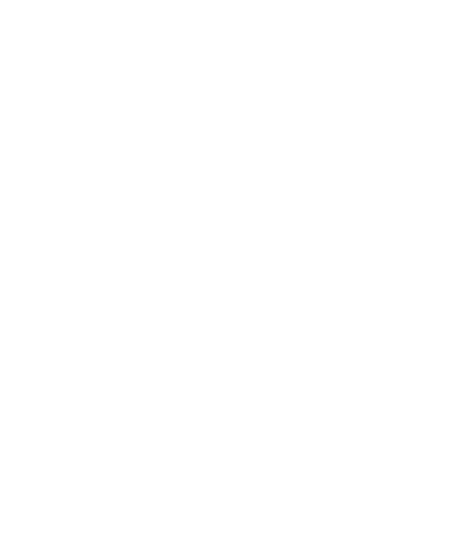

# Projet Concert

 
Projet Concert est un site web sur une salle de concert créé avec le Framework Symfony.

Date : décembre 2022 à début février 2022.

## Projects Status

Le projet est terminé.

## Contexte

Projet réalisé lors de mes études en Licence Pro : Assistant de Projet Informatique, Développement d'Application E-business afin d'apprendre l'utilisation de Symfony.

## Licence

Copyright [2022] [Giaccaglia Matthieu]

Licensed under the Apache License, Version 2.0 (the "License");
you may not use this file except in compliance with the License.
You may obtain a copy of the License at

    http://www.apache.org/licenses/LICENSE-2.0

Unless required by applicable law or agreed to in writing, software
distributed under the License is distributed on an "AS IS" BASIS,
WITHOUT WARRANTIES OR CONDITIONS OF ANY KIND, either express or implied.
See the License for the specific language governing permissions and
limitations under the License.
